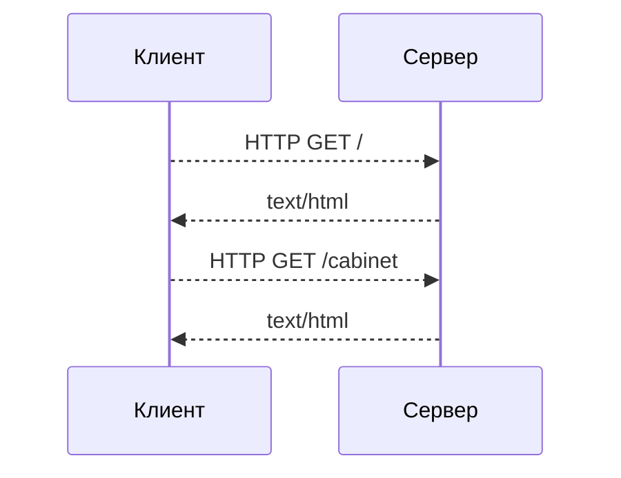
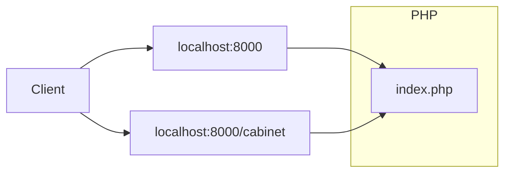
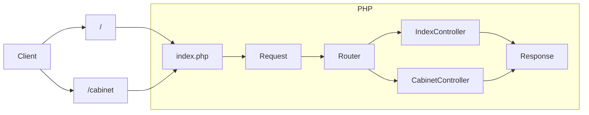

# Веб-сервис на PHP

### Веб в PHP
В отличие от других языков программирования, PHP содержит множество встроенных особенностей для работы с Веб-страницами.
Эти особенности связаны с его историческим развитием и ролью главного языка для создания веб-сайтов на протяжении многих лет.

Одна из главных фич - PHP сам по сути является шаблонизатором и выводит на страницу всё, что не заключено в теги `<?php ?>`. Кроме того, у PHP на борту есть встроенный веб-сервер, который можно использовать только для локальной разработки.  
Поэтому, для создания сайта нам достаточно написать HTML-разметку и поместить код в php-теги.
```php
<!DOCTYPE html>
<html>
    <body>
        <h1><?php echo 'Hello'; ?></h1>
    </body>
</html>
```
и запустить сервер `php -S localhost:8000`.

На первый взгляд всё хорошо, но при расширении функционала страницы, она очень быстро прирастает кодом, PHP смешивается с HTML и превращается в кашу:
```php
<?php
    include_once 'advert.php';

    $title = htmlentities($_POST['title']);
    $description = htmlentities($_POST['description']);

    if (empty($title)){
        echo "<p class=\"validation-error\">Заголовок не может быть пустым</p>";
    } elseif (empty($description) {
        echo "<p class=\"validation-error\">Описание не может быть пустым</p>";
    } else {
        $data = [
            'title' => $title,
            'description' => $description,
        ];

        $advert = new Advert($data);
        $advert->save();

        echo "<p>Объявление создано: " . $title . "</p>";
    }
?>

<!DOCTYPE html>
<html>
  <head>
    <meta http-equiv="Content-Type" content="text/html; charset=utf-8" />
    <title>Создание объявления</title>
    <style>
      .validation-error{color:red;}
      input{display:block; margin-bottom:10px;}
      h1{font-size:28px;}
      form{padding: 20px 10px;}
    </style>
  </head>

  <body>
    <h1>Новое объявление</h1>

    <form action="submit.php" method="post">
      <label for="">Заголовок:</label>
      <input name="title" id="title" type="text" value="<?php echo($title); ?>" />

      <label for="description">Описание:</label>
      <input name="description" id="description" type="textarea" value="<?php echo($description); ?>" />

      <input type="submit" value="Submit" />
    </form>
  </body>
</html>
```

Шаблон, стили и исполняемый код в одном файле. Если представить, что нужно добавить новые поля, их обработку, добавить защиту от XSS-атак, то можно создать огромный файл с очень запутанным кодом, который впоследствии будет невозможно поддерживать.
Любой развивающийся сайт или сервис, содержит десятки и сотни тысяч строк кода, нуждающихся в поддержке и обновлении. Поэтому код из примера нужен только для того, чтобы знать, как не стоит делать.

Чтобы сервис было возможно развивать, познакомимся с популярным архитектурным подходом, называемым MVC, который поддерживается популярными фреймворками и попробуем написать сервис, следуя ему. Подход к организации кода, о котором будет говориться в лекции - не единственный возможный, но один из самых популярных, если речь идёт о веб-сервисах на PHP.
Какая бы ни была архитектура вашего приложения - основная идея в том, чтобы разделить его на слои абстракции, каждый из которых будет изолированно выполнять свою роль.

Перед тем, как приступить к практической разработке сервиса, вспомним как программы обмениваются данными по сети и выделим общие признаки для всех веб-сервисов.

### Жизненный цикл
HTTP - основной протокол, используемый в веб для передачи и получения данных. Данными в этом случае обмениваются два участника - Клиент и Сервер.


1. Клиент (браузер, постман, curl и т.д.) делает HTTP-запрос на адрес нашего сервиса.  
   Запрос может быть в корень сайта localhost:8000 или запрос localhost:8000/health или localhost:8000/cabinet.   
   То, что расположено после хоста, обычно называют путь (относительный uri, эндпоинт, роут) Как правило, слова, из которых состоит путь, должны быть понятны человеком и связаны с сущностью, к которой мы обращаемся по этому роуту.
2. Сервер возвращает ответ в виде строки (json, html, простой текст) с успешным статусом или ошибкой.
Эти действия не зависят от кода, и клиент не знает на каком языке написана логика, вернувшая ответ.

Что происходит внутри сервера:

Внутри сервера работает программа, которая:
1. Принимает запрос.
2. Определяет какое действие нужно выполнить (Маршрутизация).
3. Выполняет обработку.
4. Возвращает ответ в формате, в котором клиент готов его воспринять.

Эти 4 шага можно взять за основу нашей архитектуры, так как они будут выполняться в любом случае, независимо от логики приложения.
Cхема будет расширяться и усложняться по мере прохождения практики.

## Создание сервиса на PHP.
Начнём создание нового проекта с чистого листа, и для начала создадим директорию и инициализируем новый пакет через composer:

```bash
mkdir my-php-project
cd my-php-project
composer init
```

Создадим файл index.php в директории public
```bash
mkdir public
touch public/index.php
```

Открываем любимый редактор и пишем зачаток нашего сервиса, выведем на экран содержимое глобальной переменной `$_SERVER`:
```php
<?php

echo '<pre>';
print_r($_SERVER);
```

Убедимся в том, что наш скрипт работает и запустим встроенный PHP-сервер в директории `public`.
```bash
php -S localhost:8000
```
Если перейти по адресу http://localhost:8000/, то можно увидеть вывод ассоциативного массива с данными сервера.
Сейчас нас интересует значение REQUEST_URI, и REQUEST_METHOD, показывающие, по какому пути и методу HTTP хочет обратиться клиент.

К примеру, если сделать запрос http://localhost:8000/hello, то REQUEST_URI будет содержать строку `/hello`
На основе этих значений и можно выбирать логику обработки запроса (Выполнить маршрутизацию)

Давайте попробуем сделать это и напишем простую реализацию роутера.

```php
<?php

$uri = $_SERVER['REQUEST_URI'];

if ($uri === '/hello') {
    $name = $_GET['name'] ?? 'guest';

    echo 'Hello ' . $name;
} elseif ($uri === '/server') {
    header('Content-Type: application/json; charset=utf-8');
    json_encode($_SERVER, JSON_PRETTY_PRINT|JSON_UNESCAPED_UNICODE);
} else {
    header("HTTP/1.1 404 Not Found");

    echo '404 Not Found';
}
```
Попробуем перейти по адресам и проверить вывод:
http://localhost:8000/hello
http://localhost:8000/server
http://localhost:8000/blabla

Теперь воспользуемся написанным нами функционалом по выводу имени и перейдём в http://localhost:8000/hello?name=Stark
И тут неожиданно выводится 404? Почему?
REQUEST_URI - содержит теперь так-же query-параметры, `/hello?name=Stark` и уже не подходят ни по одному условию.
Решить проблему можно с помощью функции `parse_url()`, которая разобъёт нашкт строку на 2 части - `path` и `query`.

И это только одна из проблем, с которыми мы столкнёмся. Например:
- Что если мы забудем прописать нужный заголовок, или допустим в нём ошибку?
- Что делать, если пользователь введёт путь так, с закрывающим слешем?: http://localhost:8000/hello/
- Как декодировать и кодировать html-символы
- Как защищаться от XSS-атак.

Это всё можно будет решить "в лоб", но код очень быстро вырастет и превратится в настоящую кашу, учитывая, что логика будет расширяться и проект расти.

### Разбиение на слои абстракции
Наденем мантию архитектора и подумаем, что из кода выше можно выделить и абстрагировать, чтобы можно было писать бизнес-логику и не отвлекаться на проблемы с запросами, ответами, заголовками и прочим, связанным с HTTP.

- **Запрос (Request)** - Содержит в себе заголовки, тело и мета-данные запроса.
- **Ответ (Response)** - Содержит заголовки и тело ответа.
- **Router** - Позволяет определить какой код нужно выполнить на основании Запроса.
- **Controller** - Класс, методы которого будут запущены роутером. Получает Запрос, формирует и возвращает Ответ.

Обновим нашу схему:



Вернёмся к маршрутизации. Ранее мы сказали о том, что это задача, которую вам в любом случае придется решать при написании своего сервиса. И задачи такого уровня программисты решают сообща, создавая общие библиотеки.
Таких общих задач много, и для их решения есть фреймворки и микрофреймворки.  

**Фреймворки** - предоставляют готовую базовую архитектуру и множество встроенных возможностей, в мире PHP ориентированы на создание сайтов.  
**Микрофреймворки** - предоставляют набор базовых инструментов для создания веб-приложений, маршрутизация - один из них. Но не обязывает следовать определенной архитектуре.

Абстракции **Request, Response, Router, Controller** - поддерживает абсолютное большинство фреймворков, поэтому научиившись работать с одним, и поняв, какую проблему они решают, для вас не составит труда освоить другой.

Все фреймворки решают примерно одинаковый круг задач. Что именно выбрать и использвать ли их вообще - зависит от ситуации и опыта программиста.

### Вернёмся к веб-сервису и воспользуемся роутером.
Как пример, можно воспользоваться роутером, который идет в комплекте с микрофреймворком lumen.
Установим микрофреймворк Lumen в зависимости нашего проекта.
```bash
composer require laravel/lumen
```

Подключим и запустим приложение.
```php
// public/index.php
<?php

// Загружеаем автолоадер
require_once __DIR__ . '/../vendor/autoload.php';

// Подключаем неймспейс
use Laravel\Lumen\Application;

// Создаём и возвращаем объект нашего приложения
$app = new Application(dirname(__DIR__));

$app->run();
```
Теперь можно снова открыть в браузере http://localhost:8000 и убедиться, что приложение запущено.
Под капотом, на каждый новый запрос будет стартовать новое приложение.


3. Создаём директорию для файлов проекта и для будущих контроллеров. В ней мы будем разрабатывать логику приложения
```bash
mkdir src
```

4. Регистрируем директорию app в autoload для автозагрузки:

```json
// composer.json
{
    "name": "chernyshev/views-php",
    "type": "project",
    "require": {
        "php": "^8.0",
        "laravel/lumen": "^9.0"
    },
    "autoload": {
        "psr-4": {
            "App\\": "app/"
        }
    }
}
```

5. Создаём директорию bootstrap в корне проекта и файл app.php
   В этом файле разместим логику для инициализации нашего сервиса

```php
// bootstrap/app.php
<?php


return $app;

```

7. Создадим роутер и напишем базовую обработку
```php
//routes/api.php
<?php

/** @var \Laravel\Lumen\Routing\Router $router */
$router->get('/', function () {
    return 'Hello Kolesa Backend Upgrade!';
});

```

8. Подключим свежесозданный роутер к нашему приложению
```php
//bootstrap/app.php
<?php

require_once __DIR__ . '/../vendor/autoload.php';

/**
* Создание контейнера приложения (IoC)
*/
$app = new Laravel\Lumen\Application(
    dirname(__DIR__)
);

$app->router->group([], function ($router) {
    require __DIR__ . '/../routes/api.php';
});

return $app;

```

9. Запускаем наш сервер на 8000 порту. Следует помнить, что мы используем встроенный PHP-сервер, не предназначенный для работы в продакшн-среде, но хорошо подходящий для локальной разработки
```bash
php -S localhost:8000 -t public
```

10. Зайти в браузере на http://localhost:8000/ и увидеть надпись: "Hello Kolesa Backend Upgrade!"

Обновляем автозагрузку, если файлы не подключились:
```bash
composer dump-autoload
```

Сейчас структура проекта выглядит так:
```
├───app
├───bootstrap
│    └───app.php
├───public
│    └───index.php
├───routes
│    └───api.php
├───vendor
├───composer.json
└───composer.lock

```

## Архитектура. Работаем с JSON

Добавим новый роут, который будет отдавать данные в виде JSON.

```php
//routes/api.php
<?php

/** @var \Laravel\Lumen\Routing\Router $router */
$router->get('/', function () {
    return 'Hello Kolesa Backend Upgrade!';
});

$router->get('/info', function () use ($router) {
    return response()->json([
        'engine' => $router->app->version(),
        'workOn' => 'PHP ' . PHP_VERSION,
    ]);
});
```

Добавим роут который будет принимать данные в json.

```php
//routes/api.php
<?php

use Illuminate\Http\Request;

/** @var \Laravel\Lumen\Routing\Router $router */
$router->get('/', function () {
    return 'Hello Kolesa Backend Upgrade!';
});

$router->get('/info', function () use ($router) {
    return response()->json([
        'engine' => $router->app->version(),
        'workOn' => 'PHP ' . PHP_VERSION,
    ]);
});

$router->post('/hello', function (Request $request) {
    return response()->json([
        'isJson'    => $request->isJson(),
        'greetings' => $request->get('name'),
    ]);
});
```
