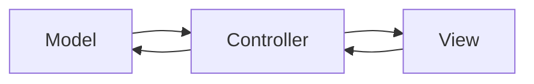
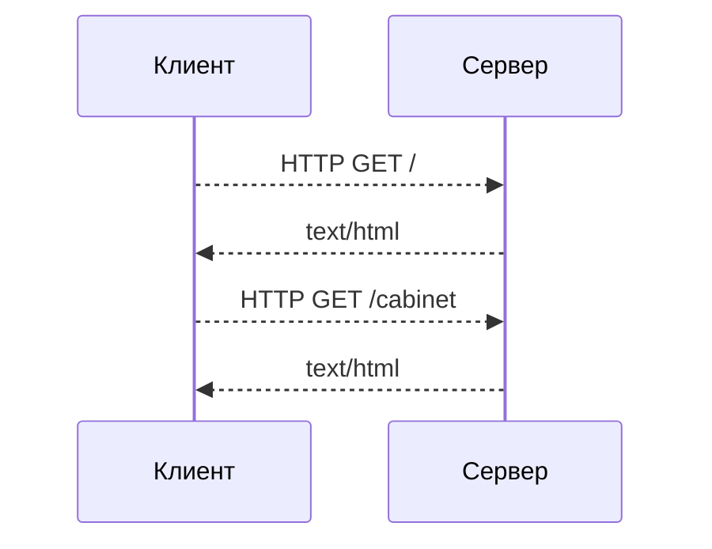
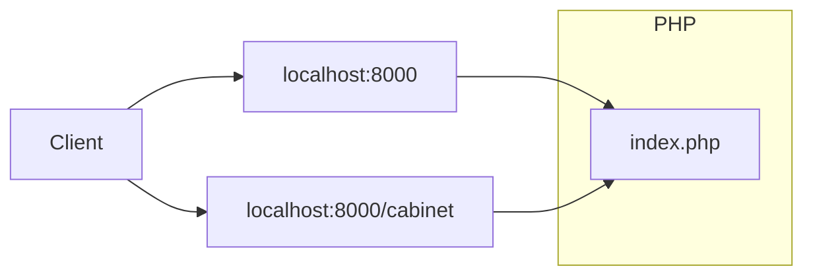
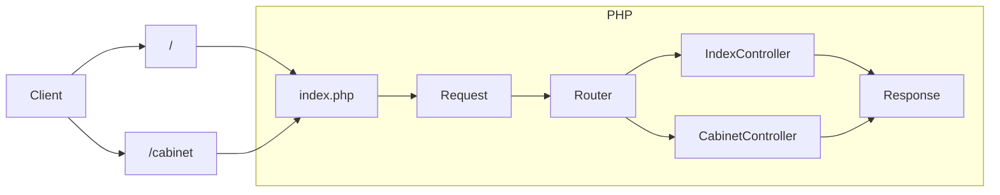

# Веб-сервис на PHP

## Веб в PHP:
В отличие от других языков программирования, PHP содержит множество встроенных особенностей для работы с Веб-страницами.
Эти особенности связаны с его историческим развитием и ролью главного языка для создания веб-сайтов на протяжении многих лет.

Одна из главных фич - PHP является шаблонизатором[^template] и выводит на страницу всё, что не заключено в теги `<?php ?>`. Кроме того, у PHP на борту есть встроенный веб-сервер, который можно использовать для локальной разработки.

Благодаря этому, для создания сайта нам достаточно написать HTML-разметку, поместить код в php-теги и запустить встроенный сервер `php -S localhost:8000`
```php
<!DOCTYPE html>
<html>
    <body>
        <h1><?php echo 'Hello'; ?></h1>
    </body>
</html>
```
>  Вcтроенный сервер предназаначен только для локального запуска и плохо справляется с нагрузкой. В продакшн-среде рекомендуем использовать php-fpm+nginx


На первый взгляд всё хорошо, но при расширении функционала страницы, она очень быстро прирастает кодом, PHP смешивается с HTML и превращается в кашу:
```php
<?php
    include_once 'advert.php';

    $title = htmlentities($_POST['title']);
    $description = htmlentities($_POST['description']);

    if (empty($title)){
        echo "<p class=\"validation-error\">Заголовок не может быть пустым</p>";
    } elseif (empty($description) {
        echo "<p class=\"validation-error\">Описание не может быть пустым</p>";
    } else {
        $data = [
            'title' => $title,
            'description' => $description,
        ];

        $advert = new Advert($data);
        $advert->save();

        echo "<p>Объявление создано: " . $title . "</p>";
    }
?>

<!DOCTYPE html>
<html>
  <head>
    <meta http-equiv="Content-Type" content="text/html; charset=utf-8" />
    <title>Создание объявления</title>
    <style>
      .validation-error{color:red;}
      input{display:block; margin-bottom:10px;}
      h1{font-size:28px;}
      form{padding: 20px 10px;}
    </style>
  </head>

  <body>
    <h1>Новое объявление</h1>

    <form action="submit.php" method="post">
      <label for="">Заголовок:</label>
      <input name="title" id="title" type="text" value="<?php echo($title); ?>" />

      <label for="description">Описание:</label>
      <input name="description" id="description" type="textarea" value="<?php echo($description); ?>" />

      <input type="submit" value="Submit" />
    </form>
  </body>
</html>
```

Разметка, стили и исполняемый код в одном файле! Если представить, что нужно добавить новые поля, их обработку, добавить защиту от XSS-атак, то можно создать огромный файл с очень запутанным кодом, который:
- Код сложно понимать, поддерживать и переиспользовать.
- Размывает границу между Back-end и Front-end, затрудняя командную разработку.
- Повышает вероятность допустить уязвимость, особенно если страница взаимодействует с базой данных.

Любой развивающийся сервис содержит десятки и сотни тысяч строк кода, нуждающихся в поддержке и обновлении. Поэтому код из примера нужен только для того, чтобы знать, как не стоит делать.

## Архитектура Веб-сервиса.

Разработка архитектуры веб-сервиса связана с выстраиванием такого способа взаимодействия между отдельными частями системы, который позволяет упростить её понимание, обслуживание и расширение.

Познакомимся с популярным архитектурным подходом, называемым MVC.   
**MVC** - это шаблон проектирования, предназначенный для удобной работы c HTTP.


> **Шаблон проектирования** - это повторяемая конструкция, которая решает часто возникающие проблемы или задачи.
> В любом случае это не догма и не спецификация и всегда оставляет вам место для самостоятельного выбора.

Расшифровка аббревиатуры **MVC:**
- **M - Model** - Слой логического ядра приложения. Изолирует в себе всю работу с предметной областью сервиса. Взаимодействует с хранилищем данных. 
- **С - Controller**  - обработчик и входная точка. Валидирует входищие данные и передаёт управление в Model. Получив ответ от слоя Model, отдаёт данные в View.
- **V - View** - Слой, отвечающий за отображение данных. Он получает данные от Controller. Наиболее часто используется для отрисовки веб-страниц.



Какая бы ни была архитектура вашего приложения - основная идея в том, чтобы разделить его на слои абстракции, каждый из которых будет изолированно выполнять свою роль. Хорошее разделение на абстракции позволяет программисту целиком воспринимать слой программы, над которым он сейчас работает и не отвлекаться на другие.

Например, при написании логики расчёта общего веса товаров в корзине, сложно одновременно держать в голове какими именно SQL-запросами были получены товары из базы данных. Мы можем решить эту проблему, выделив логику в отдельный слой. Выделение отдельной абстракции так-же позволит нам подменять реализацию получения данных без изменения бизнес-логики, но об этом позже.

### Жизненный цикл
Перед тем, как приступить к практической разработке сервиса, вспомним как программы обмениваются данными по сети и выделим общие признаки для всех веб-сервисов.

HTTP - основной протокол, используемый в веб для передачи и получения данных. Данными в этом случае обмениваются два участника - Клиент и Сервер.



1. Клиент (браузер, постман, curl и т.д.) делает HTTP-запрос на адрес нашего сервиса.  
   Запрос может быть в корень сайта localhost:8000 или запрос localhost:8000/health или localhost:8000/cabinet.   
   То, что расположено после хоста и порта (**/cabinet**), обычно называют путём или path. Cинонимы: относительный uri, эндпоинт, роут.
2. Сервер возвращает ответ в виде строки (json, html, простой текст) с успешным статусом или ошибкой.
Формат не зависит от кода, и клиент не знает на каком языке написана логика, вернувшая ответ.

Что происходит внутри сервера:

Внутри сервера работает программа, которая:
1. Принимает запрос.
2. Определяет какое действие нужно выполнить (Маршрутизация).
3. Выполняет обработку.
4. Возвращает ответ в формате, в котором клиент готов его воспринять.

Эти 4 шага можно взять за основу нашей архитектуры, так как они будут выполняться в любом случае, независимо от логики приложения.
Cхема будет расширяться по мере усложнения кода сервиса.

## Создание сервиса на PHP - Админка для объявлений
Для начала определимся с базовым функционалом сервиса:

- Из браузера должно быть доступно:
  - Создание объявлений
  - Просмотр списка объявлений
  - Просмотр одного объявления
- Сервис должен уметь сообщать о том, что он поднят и возвращать статус в виде json. (Health-check).
- У объявления должен быть заголовок, описание и цена.

Начнём создание нового проекта с чистого листа, и для начала необходимо создать директорию и инициализировать новый пакет через composer:

```bash
mkdir my-php-project
cd my-php-project
composer init
```

Создадим файл index.php в директории public
```bash
mkdir public
touch public/index.php
```

Открываем любимый редактор и пишем зачаток нашего сервиса, выведем на экран содержимое глобальной переменной `$_SERVER`:
```php
<?php

echo '<pre>';
print_r($_SERVER);
```

Убедимся в том, что наш скрипт работает и запустим встроенный PHP-сервер в директории `public`.
```bash
php -S localhost:8000
```
Если перейти по адресу http://localhost:8000/, то можно увидеть вывод ассоциативного массива с данными сервера.
Сейчас нас интересует значение REQUEST_URI, и REQUEST_METHOD, показывающие, по какому пути и методу HTTP хочет обратиться клиент.

К примеру, если сделать запрос http://localhost:8000/hello, то REQUEST_URI будет содержать строку `/hello`
На основе этих значений и можно выбирать логику обработки запроса (Выполнить маршрутизацию)

Давайте попробуем сделать это и напишем простую реализацию роутера.

```php
<?php

$uri = $_SERVER['REQUEST_URI'];

if ($uri === '/hello') {
    $name = $_GET['name'] ?? 'guest';

    echo 'Hello ' . $name;
} elseif ($uri === '/server') {
    header('Content-Type: application/json; charset=utf-8');
    json_encode($_SERVER, JSON_PRETTY_PRINT|JSON_UNESCAPED_UNICODE);
} else {
    header("HTTP/1.1 404 Not Found");

    echo '404 Not Found';
}
```
Попробуем перейти по адресам и проверить вывод:
http://localhost:8000/hello
http://localhost:8000/server
http://localhost:8000/blabla

Теперь воспользуемся написанным нами функционалом по выводу имени и перейдём в http://localhost:8000/hello?name=Stark

И тут неожиданно выводится 404.  

REQUEST_URI - содержит так-же query-параметры, `/hello?name=Stark` и уже не подходят ни по одному условию.
Решить проблему можно с помощью функции `parse_url()`, которая разобъёт нашкт строку на 2 части - `path` и `query`.

И это только одна из проблем, с которыми мы столкнёмся при разработке роутера. Например:
- Что если мы забудем прописать нужный заголовок, или допустим в нём ошибку?
- Что делать, если пользователь введёт путь так, с закрывающим слешем?: http://localhost:8000/hello/
- Как декодировать и кодировать html-символы
- Как защищаться от XSS-атак.

### Разбиение на слои абстракции
Наденем мантию архитектора и подумаем, что из кода выше можно выделить и абстрагировать, чтобы можно было писать бизнес-логику и не отвлекаться на проблемы с запросами, ответами, заголовками и прочим, связанным с HTTP.

- **Запрос (Request)** - Содержит в себе заголовки, тело и предоставляет методы для работы с ними.
- **Ответ (Response)** - Содержит заголовки, тело ответа и предоставляет методы для работы с ними.
- **Router** - Позволяет определить какой код нужно выполнить на основании Запроса.
- **Controller** - Класс, методы которого будут запущены роутером. Получает Запрос, формирует и возвращает Ответ.

Обновим нашу схему:



Можно реализовать эти абстракции самостоятельно, написав на каждый из них свой класс. И это будет очень хорошим решением, если вы хотите попрактиковаться в проектировании HTTP-фреймворка.

> **Фреймворки** - предоставляют готовую базовую архитектуру и множество встроенных возможностей, в мире PHP ориентированы на создание сайтов.
> 
> **Микрофреймворки** - предоставляют набор базовых инструментов для создания веб-приложений, маршрутизация - один из них. Но не обязывает следовать определенной архитектуре.
> 
> По-сути, фреймворк - готовый набор инструментов для решения задач, которые часто встречаются в веб-разработке.

Все фреймворки решают примерно одинаковый круг задач. Что именно выбрать и использвать ли их вообще - зависит от ситуации и опыта программиста.

Созданием своего фреймворка - это круто и очень сильно расширяет кругозор. Но, к сожалению, не приблизит нас к решению задачи, которую мы поставили перед собой - написание админки для объявлений. Поэтому подключим один из популярных микрофреймворков и воспользуемся им для работы с HTTP.

### Подключаем микрофреймворк Lumen.
Воспользуемся фреймворком, как подключаемой библиотекой.
Lumen поставляется с готовой файловой структурой, но мы не будем её использовать. 
Напишем свою упрощенную структуру, для того, чтобы лучше понять процесс написания сервиса.

[Документация Lumen](https://lumen.laravel.com/docs/9.x/)

Установим микрофреймворк Lumen в зависимости нашего проекта:
```bash
composer require laravel/lumen
```

Подключим автозагрузку и запустим приложение.
```php
// public/index.php
<?php

// Загружеаем автолоадер
require_once __DIR__ . '/../vendor/autoload.php';

// Подключаем неймспейс
use Laravel\Lumen\Application;

// Создаём и возвращаем объект нашего приложения
$app = new Application(dirname(__DIR__));

$app->run();
```

Теперь можно снова открыть в браузере http://localhost:8000 и убедиться, что приложение запущено.

## Слой Controller - обрабатываем вызовы
Воспользуемся роутером и сделаем функции-обработчики для тех страниц, что мы сделали ранее. Обратите внимание на синтаксис передачи анонимной функции как параметра другой функции.
```php
<?php

require_once __DIR__ . '/../vendor/autoload.php';

use Illuminate\Http\Request;
use Laravel\Lumen\Application;

$app = new Application(dirname(__DIR__));

$app->router->get('/', function () {
    return 'Hello Kolesa Backend Upgrade!';
});

$app->router->get('/hello', function (Request $request) {
    $name = $request->input('name', 'guest');

    return 'Hello ' . $name;
});

$app->router->get('/server', function () {
    // Пример протечки абстракции - прямое обращение к глобальной переменной
    return response()->json($_SERVER);
});

$app->run();
```
Теперь у нас появилось взаимодействие с новыми объектами, и мы больше не управляем напрямую заголовками и выводом, а используем методы, которые позволяют получить данные из запроса и записать их в ответ.
Перенесём эти функции-контроллеры в отдельные классы, чтобы не писать всю логику контроллеров в одном месте.

Для начала добавим директорию ```src``` для нашего приложения, и создадим там поддиректории ```src/Http/Controllers```:
```bash
mkdir src
mkdir src/Http
mkdir src/Http/Controllers
```

Обновим наш comsposer.json секцией `autoload` для того, чтобы работала автозагрузка классов по стандарту PSR-4
```json
{
    "name": "chernyshev/moder",
    "type": "project",
    "autoload": {
        "psr-4": {
            "App\\": "src/"
        }
    },
    "require": {
        "laravel/lumen": "^9.0"
    }
}
```

Выполним перегенерацию файла автозагрузки (Это нужно сделать один раз после изменения `composer.json`):
```
composer dump-autoload
```

В свежесозданную директорию добавим файл `IndexController.php` с классом `IndexController`
```php
<?php
namespace App\Http\Controllers;

use Laravel\Lumen\Routing\Controller as BaseController;

class IndexController extends BaseController
{
    public function index()
    {
        return 'Hello Kolesa Backend Upgrade!';
    }
}
```

Теперь зарегистрируем неймспейс в роутере и укажем, что нужно вызвать метод index в IndexController, если вызывается корневой путь `/`:
```php
// public/index.php
<?php

require_once __DIR__ . '/../vendor/autoload.php';

use Illuminate\Http\Request;
use Laravel\Lumen\Application;

$app = new Application(dirname(__DIR__));

$app->router->group([
    'namespace' => 'App\Http\Controllers',
], function ($router) {
    $router->get('/', 'IndexController@index');
});

$app->run();
```

## Слой View - рисуем web-страницы
Для отображения HTML-страниц воспользуемся шаблонизатором [Blade](https://laravel.com/docs/9.x/views), идущим в комплекте c Lumen.

Вернёмся к контроллеру главной страницы и подключим шаблон согласно [документации](https://laravel.com/docs/9.x/views#creating-and-rendering-views). 
Вызываем метод make, класса `Illuminate\Support\Facades\View;`. Метод принимает название шаблона первым аргументом и массив параметров вторым.

```php
<?php
namespace App\Http\Controllers;

use Illuminate\Support\Facades\View;
use Laravel\Lumen\Routing\Controller as BaseController;

class IndexController extends BaseController
{
    public function index()
    {
        return View::make('home');
    }
}
```

Далее необходимо создать директорию, `resources/views` и в ней файл `home.blade.php`:
```html
<html lang="ru">
    <body>
        <h1>Добро пожаловать в админ-панель, {{ $userName }}</h1>
    </body>
</html>
```
`{{ $userName }}` - конструкция, позволяющая выводить переменные, переданные в контроллере:

```php
<?php
namespace App\Http\Controllers;

use Illuminate\Support\Facades\View;
use Laravel\Lumen\Routing\Controller as BaseController;

class IndexController extends BaseController
{
    public function index()
    {
        return View::make('home', ['userName' => 'Admin']);
    }
}
```

Теперь можно открыть главную страницу сайта http://localhsot:8000 и убедиться, что шаблон был обработан.

****
[^template]: **Шаблонизатор** - инструмент, позволяющий управлять HTML-разметкой с помощью кода. Используется для динамической подстановки данных в **шаблон**, который представляет собой HTML с дополнительным синтаксисом вставки данных. 